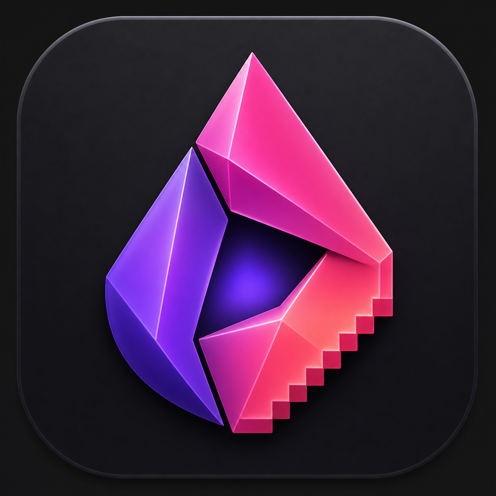
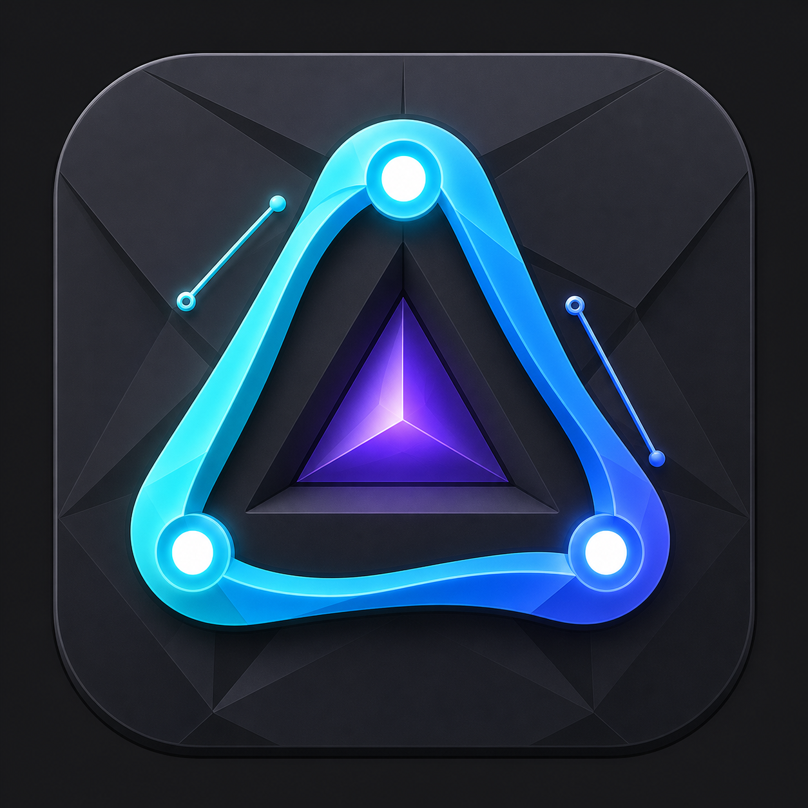
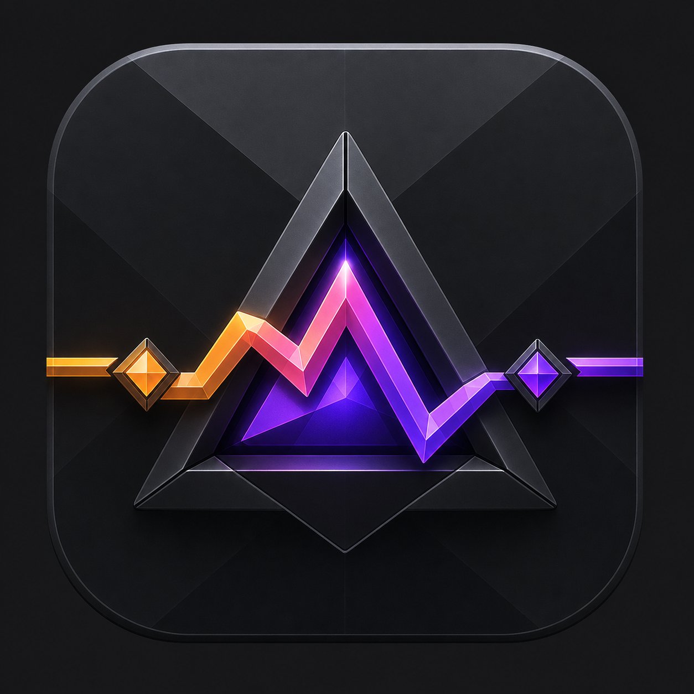
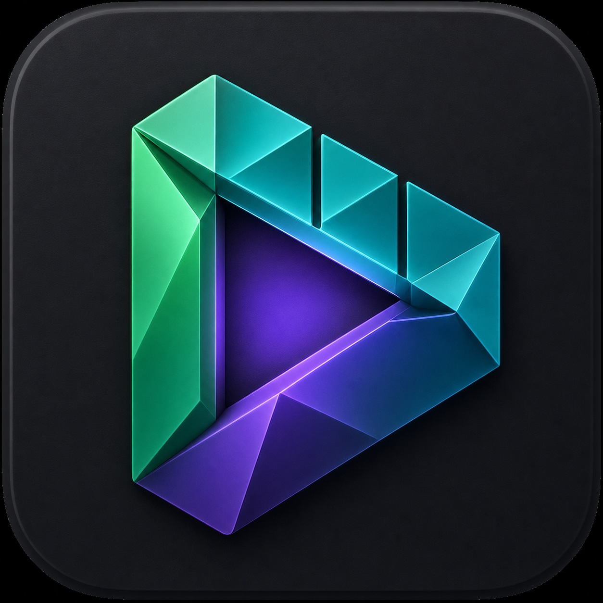

<p align="center">
  &nbsp;&nbsp;
  &nbsp;&nbsp;
  &nbsp;&nbsp;
  
</p>

<h1 align="center">Prism Suite</h1>

<p align="center">
  Free, open-source replacements for the Adobe creative suite — no vendor lock-in, no subscriptions.
</p>

---

## Apps

| App | Adobe analog | Domain | Status |
|-----|--------------|--------|--------|
| **Pigment** | Photoshop | GPU raster editor | ~65% |
| **Contour** | Illustrator | CPU vector editor | ~35% |
| **Pulse** | After Effects | CPU compositor / motion | ~25% |
| **Reel** | Premiere Pro | NLE / video editor | ~15% |

## Repository layout

```
prism-suite/
  apps/
    pigment/            — Pigment (GPUI host + GPU compositor)
    
    contour/            — Contour (GPUI host + all vector logic)
    
    pulse/              — Pulse (GPUI host + compositor + keyframe engine)
    reel/               — Reel (GPUI host + NLE logic)
  shared/
    prism-core/         — Document model, blend modes, adjustments, curves, shapes
    prism-canvas/       — wgpu GPU compositor (Pigment's raster engine)
    prism-color/        — Color science: Rgba, sRGB↔linear
    prism-io/           — File I/O: PNG/JPEG/PSD/EXR, resize, text raster
    prism-media/        — FFmpeg bridge: video decode/encode, audio
    prism-ui/           — GPUI design system: tokens, icons, components
  assets/branding/      — App icons + source PNGs
  scripts/              — package-macos.sh / package-linux.sh / package-windows.ps1
  .github/workflows/    — ci.yml (check+test), release.yml (4 apps × 3 platforms)
```

## Quickstart

```bash
git clone https://github.com/KwaminaWhyte/prism-suite
cd prism-suite

# Run an app
cargo run -p pigment
cargo run -p contour
cargo run -p pulse
cargo run -p reel

# Build all
cargo build --workspace

# Check all
cargo check --workspace
```

## Testing

```bash
# All tests
cargo test --workspace

# Per-app (the logic crates have the most tests)
cargo test -p pigment          # 35 tests: filters, lens, perspective, canvas math
cargo test -p contour          # 94 tests: document, path, boolean ops
cargo test -p pulse            # 633 tests: compositor, keyframes, render
cargo test -p reel             # project/timeline tests
```

## Packaging

```bash
# macOS .app + .dmg
bash scripts/package-macos.sh Pigment pigment com.prism-suite.pigment

# Linux .deb
bash scripts/package-linux.sh pigment Pigment pigment com.prism-suite.pigment

# Windows .zip (PowerShell)
pwsh scripts/package-windows.ps1 -AppName Pigment -Bin pigment
```

## Per-app docs

Each app has its own docs in `apps/<app>/`:

| Doc | Purpose |
|-----|---------|
| `README.md` | App overview, features, build instructions |
| `PLAN.md` | Phased roadmap to ≥85% Adobe parity |
| `CHANGELOG.md` | Version history |
| `RESEARCH.md` | Architecture research, crate choices, cited findings |

Suite-level docs at the root: [SUITE.md](./SUITE.md), [UI_SYSTEM.md](./UI_SYSTEM.md), [UI_UX.md](./UI_UX.md), [VERSIONING.md](./VERSIONING.md).

## Contributing

See [CONTRIBUTING.md](./CONTRIBUTING.md). Short version:

1. `cargo check --workspace` and `cargo test --workspace` must pass.
2. Shared crates (`shared/`) stay app-agnostic — no UI framework imports, no app-specific types.
3. App-specific logic stays in `apps/`. Promote to `shared/` only when ≥2 apps need it.
4. Update the relevant `CHANGELOG.md` under `## [Unreleased]`.

## License

MIT OR Apache-2.0
